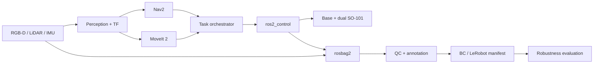

# Dual SO-101 Mobile Manipulator

An integration-first reference stack for a low-cost mobile manipulation robot: differential-drive
base, two SO-101 arms, RGB-D camera, 2D LiDAR, and IMU. The project connects modeling, simulation,
control, planning, perception contracts, demonstration data, learning, and evaluation without
rebranding the open-source systems it builds on.

## What is implemented

- **Modeling:** composable Xacro/URDF with 27 links, 26 joints, dual SO-101-compatible kinematic
  chains, sensor frames, inertials, collisions, limits, and a ros2_control system.
- **Simulation boundary:** Isaac Sim 4.5+ URDF import and physics runner plus a versioned ROS2 bridge
  topic contract. Mock hardware keeps the ROS graph testable without a GPU.
- **Control:** 100 Hz controller manager, differential-drive controller, two trajectory controllers,
  joint-state broadcasting, and explicit state/command interfaces.
- **Planning and perception:** MoveIt groups/configuration for either arm or both arms; Nav2 planner,
  controller, RGB-D voxel layer, LiDAR obstacle layer, and RGB-D/LiDAR/IMU topic contract.
- **Closed loop:** dependency-injected navigation -> perception -> plan -> execute -> verification
  state machine with fail-closed transitions.
- **Data and learning:** contract-driven rosbag2 capture, SQLite timestamp QC, annotation validation,
  SHA-256 episode manifests, and a deterministic ridge-regression BC baseline with action-bound
  metrics.
- **Engineering:** ROS 2 Jazzy devcontainer, MIT/third-party attribution, pytest, Xacro expansion,
  script compilation, and GitHub Actions.

## Architecture



See [the architecture notes](docs/ARCHITECTURE.md) for frames, ownership, rates, and safety
boundaries.

## Quick verification

```bash
python3.12 -m venv .venv
.venv/bin/pip install -e ".[dev]"
.venv/bin/xacro \
  robot_ws/src/dual_so101_description/urdf/dual_so101_mobile.urdf.xacro \
  use_mock_hardware:=true -o /tmp/dual_so101_mobile.urdf
.venv/bin/pytest
```

Inside the devcontainer:

```bash
cd robot_ws
colcon build --symlink-install
source install/setup.bash
ros2 launch dual_so101_bringup stack.launch.py use_nav2:=true use_moveit:=true
```

## Isaac Sim path

Expand the Xacro, then use Isaac Sim's own Python runtime:

```bash
xacro robot_ws/src/dual_so101_description/urdf/dual_so101_mobile.urdf.xacro \
  use_mock_hardware:=false -o /tmp/dual_so101_mobile.urdf
./python.sh isaac_sim/import_robot.py /tmp/dual_so101_mobile.urdf
./python.sh isaac_sim/run_sim.py artifacts/dual_so101_mobile.usd
```

Isaac Sim requires an NVIDIA-supported environment and is intentionally not claimed as executed in
the macOS CI environment. The repository validates the import scripts and ROS2 topic contracts;
GPU physics and hardware calibration remain deployment gates.

## Demonstration data path

```bash
mobile-data record bags/pick-0001
mobile-data qc bags/pick-0001 --json-out artifacts/pick-0001.qc.json
mobile-data train-bc datasets/pick_smoke.npz --model-out models/ridge_bc.npz
```

QC blocks dataset promotion on missing topics, wrong message types, low rates, or timestamp gaps.
Episode annotation and manifest utilities are in `data_pipeline/src/mobile_manipulation_data`.

## Repository status

This is a simulation-first v0.1 integration baseline, not a claim of finished physical hardware.
CI verifies the model/configuration/data contracts and the learning smoke path. Next milestones are
Isaac OmniGraph sensor graph generation, Nav2/MoveIt ROS adapters for the orchestrator, calibrated
SO-101 hardware adapters, and ACT/Diffusion Policy evaluation.

## Attribution

SO101-Nexus, LeRobot, ROS 2, ros2_control, MoveIt 2, Nav2, and Isaac Sim remain upstream projects.
See [NOTICE.md](NOTICE.md) for provenance and licenses. Original integration code is MIT licensed.

