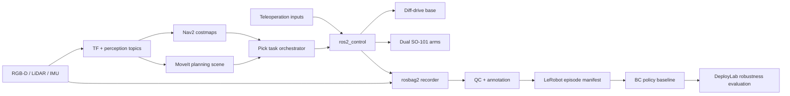

# Architecture and interface contracts

## Runtime graph

## Coordinate frames

- `map -> odom -> base_footprint -> base_link` is owned by Nav2/localization and the differential
  drive controller.
- `base_link -> torso_link -> {left,right}_base_link -> *_tcp_link` is published from the Xacro
  model and joint states.
- RGB-D optical frames follow REP-103 optical orientation. LiDAR and IMU frames are rigidly
  attached to `base_link`.

## Control boundary

The default Xacro uses `mock_components/GenericSystem` for deterministic development without
hardware. Setting `use_mock_hardware:=false` selects a topic-based ros2_control boundary intended
for Isaac Sim or a hardware adapter. The controller contract is 100 Hz internally, with base and
arm state publication at 50 Hz.

## Planning boundary

MoveIt owns the two six-joint chains and exposes `left_arm`, `right_arm`, and `dual_arms` planning
groups. Nav2 owns planar base motion. The task orchestrator deliberately sequences base navigation
before arm planning; simultaneous whole-body planning is outside the first release.

## Data quality boundary

Every episode has a recording contract, rosbag2 metadata, timestamp continuity checks, an outcome
annotation, and SHA-256 source hashes. A failed QC report cannot be promoted into a dataset
manifest. The BC baseline is intentionally small: it verifies the plumbing and action-bound
metrics before a larger ACT/Diffusion/VLA policy is introduced.

